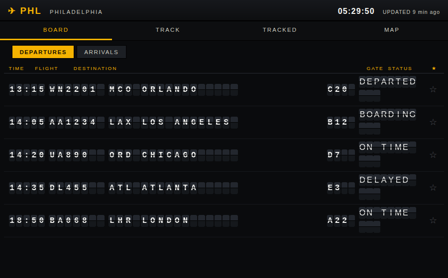

# PHL Split-Flap Flight Tracker

A retro **split-flap ("Solari board")** flight tracker for **Philadelphia
International (PHL)**, built to run on **IONOS shared hosting** (PHP + cron) and
install as a **PWA** on an iPad.



## Features

- **Board** — live departures/arrivals on an animated flip-tile board.
- **Track** — look up any flight by number (route, times, status, aircraft model).
- **Tracked** — ★ flights you care about; they persist on the device and stay fresh.
- **Map** — live aircraft positions around PHL (OpenStreetMap + OpenSky).
- Installable PWA with an offline app shell.

## How it works

The browser **never** calls the flight APIs directly. Cron jobs prefetch data
into a private cache; PHP endpoints serve only that cached JSON. This keeps API
keys secret and decouples API-unit cost from page views.

```
iPad PWA (static HTML/CSS/JS) ──► public/api/*.php ──► private/cache/*.json
                                                          ▲
Cron ──► cron/prefetch_*.php ──► AeroDataBox / OpenSky ───┘
```

### APIs (free tiers)
- **AeroDataBox** (via RapidAPI) — board, flight-by-number, aircraft-by-registration.
  Free tier ≈ 600 units/month; the airport board (FIDS) is the expensive call, so it
  refreshes on a slow cadence.
- **OpenSky Network** — live aircraft positions (OAuth2 client-credentials; free).

## Local development

```bash
cp private/config.sample.php private/config.php
# set 'mock' => true in private/config.php to use bundled sample data
php cron/prefetch_board.php      # generate cache (mock mode = no API calls)
php cron/prefetch_states.php
php -S localhost:8000 -t public  # open http://localhost:8000
```

Run `php build/generate-icons.php` to (re)generate the PWA icons.

## Deploy to IONOS shared hosting

1. **Upload** the repo. In the IONOS panel, set the domain's **document root to the
   `public/` folder** so `private/` can't be reached by URL. (If you can't change the
   doc root, the included `.htaccess` files deny `private/` as a fallback.)
2. **Configure**: copy `private/config.sample.php` → `private/config.php` and fill in:
   - `rapidapi_key` (AeroDataBox on RapidAPI)
   - `opensky_client_id` / `opensky_client_secret` (optional; blank = anonymous)
   - Set `'mock' => false`.
3. **Cron jobs** (IONOS Cron Manager, PHP CLI). Each run finishes in well under the
   60-second IONOS limit:
   ```
   */60 5-23 * * *   php /path/to/cron/prefetch_board.php     # board (operating hours)
   0    */2  * * *   php /path/to/cron/prefetch_flights.php    # starred/tracked flights
   */2  *    * * *   php /path/to/cron/prefetch_states.php      # live map
   ```
4. **Verify**:
   - `https://yourdomain/api/health.php` → cache ages + remaining unit budget.
   - `https://yourdomain/private/config.php` → must return 403/404.
5. **Install on the iPad**: open the site in Safari → Share → **Add to Home Screen**.

### Staying within the free quota
`board_refresh_min` and friends live in `private/config.php`. The dominant cost is the
board (FIDS). After deploy, watch the RapidAPI dashboard for a week and tune the board
cron cadence to land under ~600 units/month. A ~$5–9/mo AeroDataBox tier removes the
limit with no code changes. The client (`AeroDataBox.php`) also hard-stops and serves
stale cache once the monthly budget is reached.

## Airports (multi-airport)
The selectable airports live in **`public/airports.json`** — edit that list to add or
remove airports (each needs `icao`, `iata`, `name`, `lat`, `lon`). The header dropdown is
built from it, the build generates a board per airport, and the radar centres on whichever
is selected (the choice is remembered per device).

- The **radar** is client-side, so it can centre on any airport at no API cost.
- The **boards** use AeroDataBox. In mock mode (no key) all airports show sample data with a
  "SAMPLE DATA" badge. With a real key, **each airport costs ~2 calls per refresh** — keep the
  list short or raise the cron/Actions interval to stay under the free ~600 units/month.
- To make an airport **radar-only** (no board, no API cost), add `"boards": false` to its
  entry in `airports.json`.

## Project layout
```
public/    static PWA + read-only PHP API (this is the web root)
private/   secrets (config.php) + JSON cache  — NEVER web-served
cron/      prefetch scripts + API client libs + mock fixtures
build/     optional build-time tooling (icon generation)
```
